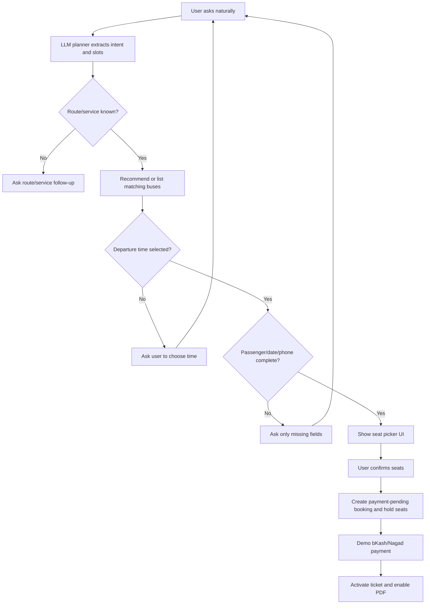
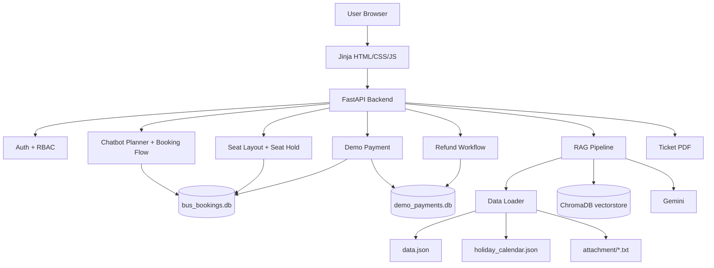
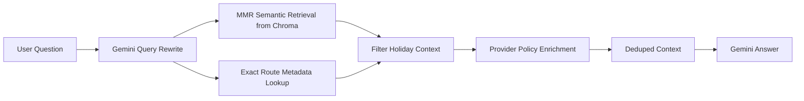

# BusGo - Banglish AI Bus Ticket Booking Platform

BusGo is an AI-assisted bus ticket booking web application for Bangladeshi users who naturally search and book tickets in English or Banglish. The platform combines a conversational booking assistant with route search, fare comparison, seat selection, demo payment, ticket PDF download, user dashboard, admin dashboard, RBAC, cancellation, refund approval, RAG retrieval, and RAGAS evaluation.

The main goal is to reduce rigid form filling. Users can ask naturally, the chatbot extracts booking details across turns, asks only for missing information, and connects the conversation to real UI actions such as seat selection, payment, and ticket download.

## Key Highlights

| Area | Implementation |
|---|---|
| Conversational AI | Banglish/English chatbot powered by Gemini |
| RAG | LangChain + ChromaDB + Sentence Transformers + Gemini |
| Search Strategy | Semantic vector search with MMR, exact route metadata injection, provider policy enrichment |
| Not Used | No BM25, no hybrid search, no RRF, no Self-RAG/CRAG |
| Booking Automation | Chatbot collects route, provider, bus type, time, passenger, date, and phone details |
| Seat Selection UI | Interactive picker with available, selected, booked, female-reserved, and window-seat states |
| Demo Payment | bKash/Nagad demo wallet with PIN validation and wallet deduction |
| Ticket Lifecycle | Payment-pending booking, 5-minute hold, paid ticket, PDF download, cancellation |
| User Management | Signup/login, dashboard, chatbot-assisted account creation after booking |
| RBAC | Separate user and admin dashboards |
| Refund Workflow | Paid cancellation creates admin refund request; approval returns demo wallet balance |
| Evaluation | Golden regression tests and RAGAS faithfulness/context metrics |
| Deployment | Docker and Docker Compose with persistent named volumes |

## Tech Stack

| Layer | Tools |
|---|---|
| Backend | FastAPI, Pydantic |
| Frontend | Jinja templates, HTML, CSS, JavaScript |
| Database | SQLite |
| AI / LLM | Gemini via `langchain-google-genai` |
| RAG Framework | LangChain |
| Vector Database | ChromaDB |
| Embeddings | `sentence-transformers/all-MiniLM-L6-v2` |
| Evaluation | Golden tests, RAGAS |
| Runtime | Docker, Docker Compose |

## Core Features

### Banglish AI Chatbot

Example queries:

```text
Dhaka theke Rangpur e shobcheye kom dam e kon AC bus ase?
Dhaka theke Rangpur e kom dam er Non AC bus konta?
dhaka theke cox bazar e vlo bus konta?
amar ticket cancel krte hbe
refund pabo kivabe
amar mobile number e booking ase kina check kore den
```

The assistant can:

- Detect source and destination from Banglish text.
- Understand cheapest fare, quality preference, AC/Non-AC preference, booking, cancellation, refund, and lookup intents.
- Answer route, fare, departure time, provider, contact, and policy questions.
- Use conversation context for follow-up questions such as `non ac nai?` or `ei time gula kon bus er?`.
- Ask for missing booking details only when required.
- Show the seat picker when booking details are ready.
- Guide the user to demo payment and ticket PDF download after seat confirmation.

### Conversational Booking Flow

The chatbot collects or confirms:

- Passenger name
- Phone number
- Source district
- Destination district
- Bus provider
- Bus type
- Dropping point
- Travel date
- Passenger count
- Departure time
- Seat numbers

If a selected service has multiple departure times, the backend does not silently choose the first option. The assistant asks the user to choose a departure time before seat selection.



### Seat Selection

Bookings are not finalized until the user selects seats.

The seat picker supports:

- Available seats
- Selected seats
- Booked seats
- Female-reserved indicators
- Window-seat indicators
- Passenger-count validation

Seat blocking is scoped by:

- Provider
- Source and destination
- Travel date
- Bus type
- Departure time

This prevents duplicate seat booking for the same service instance.

### Demo Payment

The app includes a demo payment system backed by `demo_payments.db`.

Supported demo providers:

- bKash
- Nagad

Seeded demo PIN:

```text
1234
```

Payment lifecycle:

1. User selects seats.
2. Backend creates a payment-pending booking.
3. Seats are held for 5 minutes.
4. User pays using demo bKash/Nagad phone, amount, and PIN.
5. Wallet balance is deducted.
6. Booking becomes paid/active.
7. Ticket PDF download becomes available.

### Reduced Signup Friction

After a successful booking, the chatbot can offer account creation. Since the booking conversation already contains name and phone number, the account setup form can prefill those fields and ask only for a password.

Logged-in users can reuse saved name and phone details in future bookings.

### User Dashboard

Logged-in users can view:

- Active tickets
- Payment-pending tickets
- Travel history
- Cancelled tickets
- PDF download links
- Payment completion actions
- Cancellation/refund options

### Admin Dashboard and RBAC

BusGo has role-based access control for user and admin roles.

Admin dashboard includes:

- Dashboard summary
- Bookings
- Routes
- Buses and seats
- Users
- Operators
- Reports
- Refunds
- Settings

Admins can view system-wide bookings, revenue summary, routes, users, operators, reports, and refund requests. Wallet balances are intentionally hidden from the admin dashboard.

### Cancellation and Refund Workflow

Refund behavior:

- If an unpaid ticket is cancelled, the bot explains that no money was deducted.
- If a paid ticket is cancelled, a refund request is created for admin review.
- The chatbot tells the user:

```text
Apnar refund request admin panel e dewa hoyeche. Apni 48 hrs er moddhe refund peye jaben.
```

- After admin approval, the refund amount is returned to the same demo wallet used for payment.

## System Architecture



## RAG Pipeline

The RAG pipeline is implemented in `backend/rag_pipeline.py` and `backend/data_loader.py`.

Data sources:

- `data.json`: districts, dropping points, providers, route schedules, fares, amenities, ratings
- `holiday_calendar.json`: holiday surcharge windows
- `attachment/*.txt`: provider policy/contact/support text

Chunk examples:

- District and dropping-point chunks
- Provider profile chunks
- Route summary chunks
- Route-provider service chunks
- Reverse-route hint chunks
- Provider policy/contact chunks
- Holiday calendar chunks
- General information chunks

### Retrieval Details

Current retrieval uses:

- ChromaDB persistent vectorstore
- HuggingFace sentence-transformer embeddings: `sentence-transformers/all-MiniLM-L6-v2`
- Chroma retriever with `search_type="mmr"`
- `k=18`, `fetch_k=60` for general retrieval
- `k=12`, `fetch_k=40` with provider metadata filter when a provider is detected
- Gemini-based query rewriting before retrieval
- Exact route-document injection using metadata filters when source/destination are detected
- Provider policy enrichment for providers found in retrieved route docs
- Holiday context filtering so Eid/holiday text is not injected unless the user asks for it




The `/query/detailed` endpoint returns:

- `answer`
- `contexts`
- `source_documents`

This endpoint is used for RAGAS evaluation.

## Evaluation

### Golden Regression Tests

Golden tests validate app behavior such as:

- Route/fare answers
- Cheapest bus answers
- Seat UI payload shape
- Booking flow correctness
- Payment/refund behavior
- Latency per case

Run all golden tests:

```powershell
.\venv\Scripts\python.exe run_golden_tests.py --base-url http://127.0.0.1:8004
```

Run one category:

```powershell
.\venv\Scripts\python.exe run_golden_tests.py --category route_fare
```

Run one case:

```powershell
.\venv\Scripts\python.exe run_golden_tests.py --case seat_ui_payload_shape
```

### RAGAS Evaluation

RAGAS is used for chatbot/RAG answer evaluation, not for database booking correctness.

The evaluator supports:

- Faithfulness
- Answer relevancy
- Context precision
- Context recall
- Answer correctness
- Answer similarity
- Context entity recall

For the Banglish RAGAS run, the most useful metrics were:

- Faithfulness
- Context precision
- Context recall

Current Banglish RAGAS result:

```text
Faithfulness:       0.921875  (~92.19%)
Context Precision:  0.864583  (~86.46%)
Context Recall:     1.000000  (100%)
Rows evaluated:     8
```

Collect chatbot answers:

```powershell
.\venv\Scripts\python.exe run_ragas_eval.py --dataset tests\ragas_banglish_dataset_10.json --base-url http://127.0.0.1:8004 --limit 10 --collect-only --report-json tests\ragas_banglish_report.json
```

Run faithfulness, precision, and recall:

```powershell
.\venv\Scripts\python.exe run_ragas_eval.py --from-report tests\ragas_banglish_report.json --limit 10 --metrics faithfulness,context_precision,context_recall --max-contexts 5 --report-json tests\ragas_banglish_fpr_report.json --report-csv tests\ragas_banglish_fpr_report.csv
```

Run all supported RAGAS metrics:

```powershell
.\venv\Scripts\python.exe run_ragas_eval.py --from-report tests\ragas_banglish_report.json --limit 10 --metrics all --max-contexts 5 --report-json tests\ragas_all_report.json --report-csv tests\ragas_all_report.csv
```

## Important API Endpoints

| Method | Endpoint | Purpose |
|---|---|---|
| POST | `/query/smart` | Main chatbot endpoint used by the UI |
| POST | `/query/detailed` | RAG answer with contexts/source documents |
| POST | `/chat/confirm-seat-booking` | Confirm seats selected from chatbot seat picker |
| POST | `/chat/create-account` | Create account from chatbot-captured name/phone |
| GET | `/seat-layout` | Get seat layout for a service |
| GET | `/route-services` | Get route services, fares, and schedules |
| POST | `/payments/demo` | Process demo bKash/Nagad payment |
| POST | `/refunds/request/{booking_id}` | Request refund |
| POST | `/refunds/approve/{refund_id}` | Admin approves refund |
| GET | `/user/dashboard` | User dashboard data |
| GET | `/admin/dashboard` | Admin dashboard data |
| GET | `/tickets/{booking_id}.pdf` | Download printable ticket PDF |

## Project Structure

```text
backend/
  main.py                 FastAPI routes, chatbot flow, booking/payment/refund logic
  database.py             Booking/user/auth SQLite helpers
  payment_database.py     Demo wallet, payment, and refund SQLite helpers
  models.py               Pydantic models
  rag_pipeline.py         Chroma/LangChain/Gemini RAG pipeline
  data_loader.py          Data, route, holiday, and policy chunk generation

templates/
  base.html
  index.html
  assistant.html
  dashboard.html
  admin.html
  bookings.html
  login.html
  providers.html
  routes.html

static/
  css/style.css
  js/main.js

attachment/               Provider policy/contact text files
tests/                    Golden and RAGAS datasets/reports

data.json                 Routes, providers, fares, schedules, ratings, amenities
holiday_calendar.json     Holiday surcharge rules
bus_bookings.db           Local booking/user SQLite database
demo_payments.db          Local demo wallet/payment/refund database
run_golden_tests.py       Golden regression evaluator
run_ragas_eval.py         RAGAS evaluator
requirements.txt
Dockerfile
docker-compose.yml
```

## Local Setup

Create and activate a virtual environment:

```powershell
python -m venv venv
.\venv\Scripts\activate
```

Install dependencies:

```powershell
pip install -r requirements.txt
```

For RAGAS:

```powershell
.\venv\Scripts\python.exe -m pip install ragas datasets
```

Create a `.env` file:

```env
GOOGLE_API_KEY=your_google_api_key_here
GOOGLE_MODEL=gemini-2.0-flash
```

Start the app:

```powershell
.\venv\Scripts\python.exe -m uvicorn backend.main:app --host 127.0.0.1 --port 8004
```

Open:

```text
http://127.0.0.1:8004
```

Useful pages:

```text
http://127.0.0.1:8004/                  Book Ticket
http://127.0.0.1:8004/assistant-page    AI Assistant
http://127.0.0.1:8004/bookings-page     My Bookings by phone
http://127.0.0.1:8004/dashboard-page    User Dashboard
http://127.0.0.1:8004/admin-page        Admin Dashboard
http://127.0.0.1:8004/providers-page    Providers
http://127.0.0.1:8004/routes-page       Routes & Fares
http://127.0.0.1:8004/login-page        Login
http://127.0.0.1:8004/docs              API docs
```

## Docker Setup

Create a `.env` file in the project root:

```env
GOOGLE_API_KEY=your_gemini_api_key
GOOGLE_MODEL=gemini-2.0-flash
```

Build and run:

```bash
docker compose up -d --build
```

Open:

```text
http://127.0.0.1:8004
```

Useful commands:

```bash
docker compose logs -f app
docker compose ps
docker compose down
```

Docker persists runtime data in named volumes:

- `busgo_data`: booking DB, demo payment DB, Chroma vectorstore
- `busgo_hf_cache`: Hugging Face embedding model cache

Reset Docker runtime data:

```bash
docker compose down -v
```

Do not share `docker compose config` output publicly because it expands `.env` values and can print the Gemini API key.

## Demo Credentials

Admin:

```text
admin@busgo.local
admin123
```

Demo wallet PIN:

```text
1234
```

## Example User Journey

```text
User: dhaka theke rangpur er ac bus er ticket lagbe?
Bot: Suggests AC buses, fares, and departure times.

User: National Travels 10:00 nibo
Bot: Asks for missing name, phone, passenger count, and travel date.

User: Shoaib, 01309183295, 3 jon, kalke
Bot: Opens seat picker.

User: Selects A3, B3, C3
System: Creates payment-pending booking and holds seats for 5 minutes.

User: Pays through demo bKash/Nagad
System: Confirms ticket and enables PDF download.
```

## Troubleshooting

### Port Already In Use

```powershell
$pid=(Get-NetTCPConnection -LocalPort 8004 -State Listen).OwningProcess
Stop-Process -Id $pid -Force
```

### Gemini Quota Exhausted

- Check that `.env` contains a valid `GOOGLE_API_KEY`.
- Confirm that the Google AI Studio project has quota.
- Wait for quota reset or use another API key/project.
- Restart the FastAPI server after changing `.env`.

### ChromaDB Stale Data

The vectorstore stores an index manifest based on chunk signature. If retrieval seems stale:

```powershell
Remove-Item -Recurse -Force vectorstore
```

Then restart the app.

For Docker:

```bash
docker compose down -v
docker compose up -d --build
```

## Future Improvements

- Add real payment gateway integration.
- Add WhatsApp/SMS ticket delivery.
- Add PostgreSQL for production.
- Add hybrid BM25 + vector search with RRF if semantic MMR retrieval becomes insufficient.
- Add multilingual UI toggle.
- Add live operator inventory integration.

## License

MIT License. See `LICENSE`.
